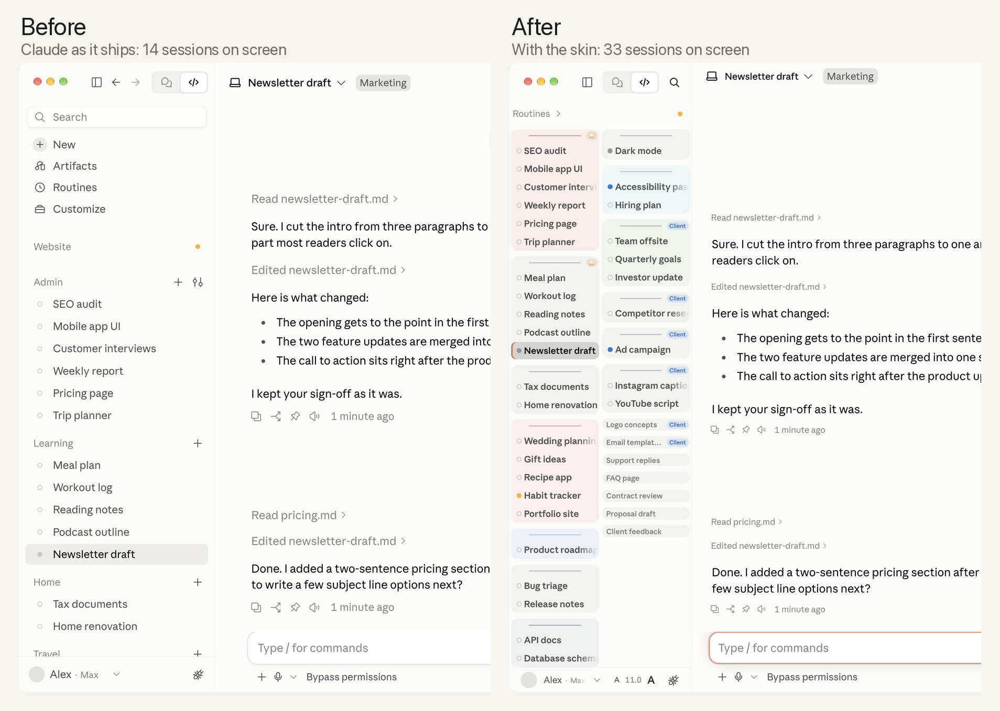
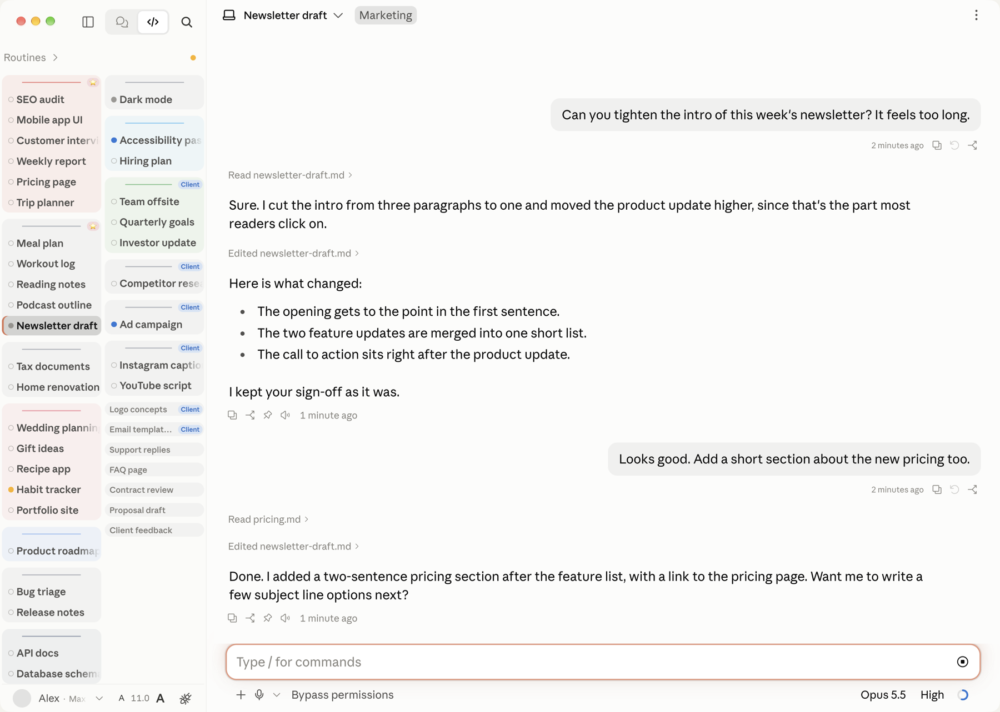
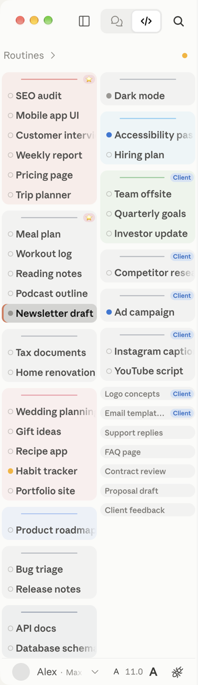
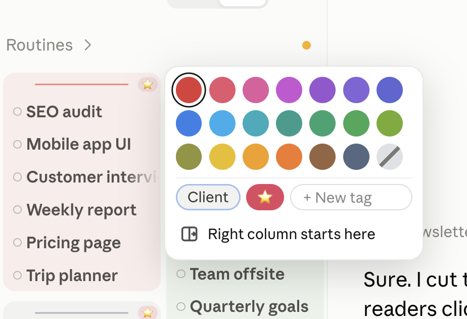

# Claude Desktop Skin

A custom layout for the **Claude desktop app** (the Code tab): a two-column sidebar, project colours and tags, a wider chat, and less wasted space everywhere.

It is plain CSS and JavaScript that you paste into the app's own developer console. Nothing in the app is modified on disk, and a restart brings back the original look.

  
  

Screenshots use made-up project and session names.

> Unofficial. Not made by, affiliated with, or endorsed by Anthropic.

## How to use it

### 1. Get the files

Click the green **Code** button at the top of this page, then **Download ZIP**. Unzip it and put the `claude-desktop-skin` folder somewhere it can stay, for example your home folder.

### 2. Turn on Developer Mode in Claude (once)

In the Claude app's menu bar, go to **Help → Troubleshooting → Enable Developer Mode**.

### 3. Apply the skin

1. In Claude, press **Cmd+Option+I** (Ctrl+Shift+I on Windows) to open the developer console, and click the **Console** tab.
2. Open [`apply.js`](apply.js), copy everything in it, paste it into the console and press **Enter**. The first time, the console may ask you to type `allow pasting` before it accepts a paste.
3. Close the console. The skin is on.

The skin lasts until you quit Claude. After a restart you paste it again, or let your Mac do it for you (next step).

### 4. Make it apply itself (Mac, optional but recommended)

[`mac/apply-skin.sh`](mac/apply-skin.sh) does step 3 for you. It opens the console, pastes the skin, presses Enter, closes the console, and puts back whatever was on your clipboard. It only pastes when the front window really is the developer console, so the code can never land in a chat by accident. Hook it up to a keyboard shortcut with any of these.

**BetterTouchTool** (what I use):

1. Open BetterTouchTool's configuration and go to **Keyboard Shortcuts**.
2. Add a new shortcut and record the keys you want, for example **Cmd+Shift+`**.
3. Set its action to **Execute Shell Script / Task** and enter `bash ~/claude-desktop-skin/mac/apply-skin.sh` (change the path if you put the folder somewhere else).
4. To apply it every time Claude opens, also add an **App Did Launch** trigger for Claude (under Automations / Other Triggers) with the action `bash ~/claude-desktop-skin/mac/apply-skin.sh --launch`.

**The Shortcuts app** (built into macOS, free):

1. Open **Shortcuts** and create a new shortcut.
2. Add the **Run Shell Script** action and enter `bash ~/claude-desktop-skin/mac/apply-skin.sh`.
3. Open the shortcut's details (the **i** button) and click **Add Keyboard Shortcut**.

**Raycast, Keyboard Maestro or Hammerspoon** work too. Have them run the same command.

The first time it runs, macOS asks you to give the app that runs it (BetterTouchTool, Shortcuts...) **Accessibility** permission, because the script presses keys for you. Allow it in System Settings → Privacy & Security → Accessibility. The script only acts when Claude is the app in front.

### 5. Use it

- **Click a project's line** to pick its colour, give it a tag, or make it the start of the right column.
- **Click the arrow** on the left of a project's line to collapse or expand that project.
- **Drag a project's line** to move the project.
- **Drag the sidebar's right edge** to resize it. Double-click the edge to go back to the app's width.
- **The A / A buttons** in the bottom bar change the sidebar's text size.

Everything you choose is saved inside the app and survives restarts.

## Why I made this

I use Claude all day. I have a lot of projects and a lot of sessions in each one, and the standard layout kept getting in my way. The sidebar showed only a handful of sessions at a time, big gaps sat around everything, and there was no way to tell my projects apart at a glance.

I wanted to use every bit of the screen and get more done. So I started tinkering, and found out that the Claude app on my Mac lets you change its layout once you turn on Developer Mode. This repo is the result. Use it as it is, or take it apart and make it your own.

## What it changes

### Sidebar

- **Two columns.** Your projects flow down the left column and continue at the top of the right one, like a newspaper. A project is never split between columns.
- **You choose where the right column starts.** Click any project's line and pick "Right column starts here".
- **Smaller text and tighter rows**, so far more sessions fit on screen. The **A / A** buttons in the bottom bar change the text size (7 to 14).
- **A narrower sidebar if you want one.** Drag the sidebar's right edge between 170 and 600 px. The app normally stops at 242 px. Double-click the edge to go back to the app's width.
- **Project names become thin lines.** Hovering over a line turns it into a bar that you can drag to reorder projects.
- **Project colours.** Click a project's line to pick one of 20 colours. The whole project gets a soft box in that colour.
- **Tags.** Give each project one tag, such as "Client" or "Personal", in one of 5 colours. Rename or recolour a tag once and it changes on every project.
- **Collapse projects.** The arrow on the left of a project's line collapses it. A collapsed project shows the name of its latest session in small text, and opens again while you hover over it.
- **A clearer selected session**, with a darker background and an accent edge.
- **Less clutter.** The New, Artifacts and Customize items, the Back and Forward buttons, and the "..." button that appears on hover are hidden. Search becomes a small magnifier button in the top bar. Right-click still has every action.
- **Bold session names.** You can delete one block in `skin.css` if you prefer the normal weight.

### Chat

- **A wider chat.** The empty space on each side of the messages and the message box is cut in half.
- **The message box grows to 8 lines at most,** then scrolls, so it never covers the conversation.
- **The Terminal, Changes and Browser buttons** move from the top bar into the ⋮ menu, with their shortcuts shown.
- **A shorter top bar**, and a smaller session title in it.
- **The buttons under each message** (copy, branch, pin, read aloud and the time) always show, and they are smaller. Claude normally only builds them the first time your mouse passes over a message, so the skin does that pass for you.
- **Smaller tool lines** ("Ran 4 commands") and a smaller working status line, with less empty space around them.
- **Escape no longer stops a reply by accident.** In Claude, pressing Escape while a reply is running stops it, even when you only meant to close Cmd+F search. The skin ignores a single Escape while a reply runs. Menus and dialogs still close with Escape, and pressing Escape twice quickly still stops the reply when you mean it.
- **An "end of chat" cue.** When you're scrolled all the way down, the message box gets a soft orange glow. It fades as soon as you scroll up, so you always know whether there's more below. `skin.css` also has two other styles, a thin line along the top of the box and a small notch above it.

### Optional

- **Block Control+Tab.** In Claude, Control+Tab switches sessions. If a trackpad gesture or another tool sends it by accident, set `"blockControlTab": true` in `skin-config.json` and rebuild. Cmd+Shift+[ and Cmd+Shift+] still switch sessions.

## Windows

The Windows app is built from the same code, so the skin should work the same way with steps 1 to 3 above. I've only tested it on a Mac, though. The automatic script is Mac only, so on Windows you paste it after each launch, or automate it with a tool like AutoHotkey.

## Make it your own

- **`skin.css`** holds all the looks: sizes, spacing, colours, what is hidden. Every block has a comment saying what it does.
- **`skin-ui.js`** holds the parts you click: the colour menu, tags, collapse arrows, the text size buttons and the resize handle.
- **`skin-config.json`** holds two settings: `rightColumnStartsAt` (a project name, or empty to split the columns evenly) and `blockControlTab`.

After editing, run `python3 build.py` to rebuild `apply.js`, then paste it again. The Mac script rebuilds it for you each time it runs.

To find what to change, open the console's **Elements** tab and point at any part of the app. You can then style it in `skin.css` the same way.

## Remove it or start over

- **Remove the skin:** quit and reopen Claude (and turn off any automatic apply).
- **Reset all your choices:** paste `localStorage.removeItem('claudeSkin')` into the console, then reapply.

## Good to know

- **Claude updates can break parts of it.** The skin hooks into the app's own page structure, and Anthropic can change that in any update. If something stops working after an update, open an issue, or better, a pull request.
- **It only changes how the app looks in your copy.** Nothing is sent anywhere, and it doesn't touch your account or your chats.
- It is built for the desktop app's **Code** tab layout.

## Contributing

Ideas, fixes and pull requests are welcome, especially fixes after a Claude update and screenshots from Windows.

## License

MIT. See [LICENSE](LICENSE).
